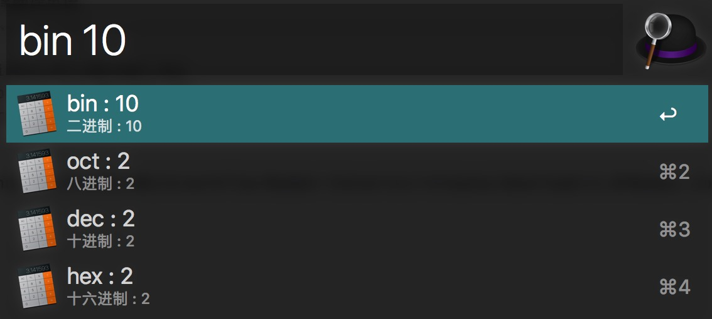
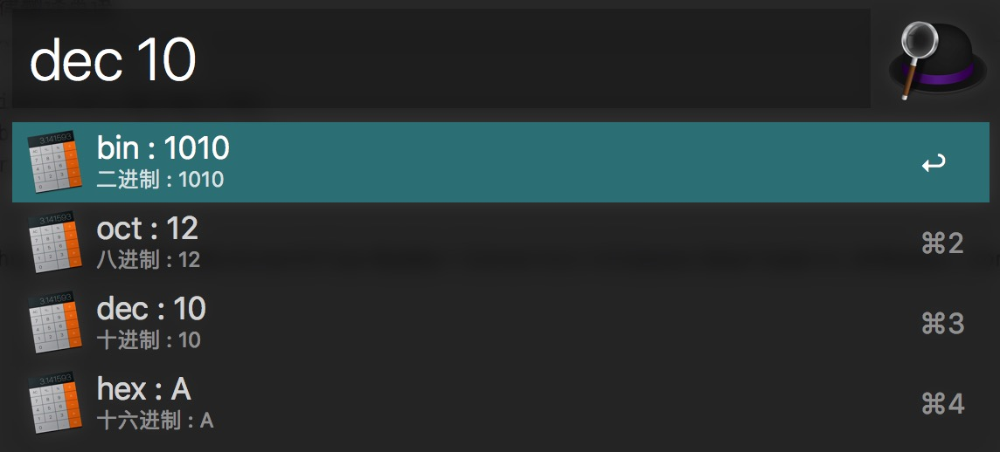

# workflow-Number-Convertor

## Introduction
#### Number Convertor by Alfred-workflow 
#### Support  
##### &ensp;&ensp;1. &ensp;&ensp;`Binary` to binary,octal,decimal,hex
##### &ensp;&ensp;2. &ensp;&ensp;`Decimal` to binary,octal,decimal,hex
##### &ensp;&ensp;3. &ensp;&ensp;`Hex` to binary,octal,decimal,hex

## Download
[Alfred workflow](https://github.com/AlexNickNick/workflow-Number-Convertor/releases/download/v1.0/Number.Convertor.alfredworkflow)

## Preview
##### Key : `bin`

##### Key : `dec`

##### Key : `hex`

